<div align="center">

# `mahmoud@github:~$ whoami`

<p>
  <strong>Mahmoud Alyosify</strong><br>
  <sub>AI & Machine Learning Engineer · LLM Systems · Efficient Inference · MLOps</sub>
</p>

<a href="https://mahmoudalyosifysite.github.io/">Portfolio</a> ·
<a href="https://www.linkedin.com/in/mahmoudalyosify/">LinkedIn</a> ·
<a href="mailto:mahmoud.alyosify@gmail.com">Email</a> ·
<a href="https://huggingface.co/mahmoudalyosify/">Hugging Face</a>

<p>
  
  
  
  
  <a href="https://github.com/MahmoudAlyosify/MahmoudAlyosify/actions/workflows/update-profile-art.yml"></a>
</p>

<br><br>

<h3><code>mahmoud@github:~$ ./contributions.sh</code></h3>


<br>



<br><br>

<table>
  <tr>
    <td valign="top"></td>
    <td valign="top"></td>
  </tr>
</table>

<br>

<sub><code>STATUS: researching efficient language-model inference · building production AI systems</code></sub>

<p>
  
  
</p>

</div>

---

## `mahmoud@github:~$ cat ./README.md`

I build **end-to-end intelligent systems** that connect research ideas to reliable software. My current focus is training-free LLM inference efficiency, multi-agent intelligence workflows, self-supervised representation learning, and reinforcement-learning systems for cloud operations.

I am completing an **MSc in Artificial Intelligence at Queen's University, Canada**, supported by the **Digilians Presidential Scholarship**. Alongside research, I have delivered AWS-based ML systems, taught more than **10,000 learners**, and published technical education viewed more than **700K times**.

## `./focus`

| Area | What I work on |
|---|---|
| **Efficient LLM systems** | Custom decoding, verbosity-aware generation, LoRA/QLoRA, PEFT, benchmarking, and inference optimisation. |
| **Agentic intelligence** | Multi-agent orchestration, RAG, knowledge graphs, OSINT, and evidence-backed reporting. |
| **Applied deep learning** | Computer vision, self-supervised learning, contrastive objectives, NLP, and reinforcement learning. |
| **Production ML** | AWS, Docker, FastAPI, ONNX, FAISS, CI/CD, reproducible evaluation, and deployment-ready pipelines. |

## `./mlops_stack`

I design ML workflows with a production mindset: reproducible experiments, versioned data outputs, automated validation, deployable inference services, and scheduled refreshes. My current MLOps toolkit includes:

| MLOps layer | Tools and practices |
|---|---|
| **Source and automation** | Git, GitHub, GitHub Actions, Linux, Bash, scheduled workflows, auto-commits, and CI checks. |
| **Cloud and packaging** | AWS, Docker, FastAPI, Streamlit, environment pinning, and deployment-oriented project structure. |
| **Model delivery** | PyTorch, TensorFlow, Transformers, Hugging Face, ONNX, custom inference pipelines, and self-hosted model serving. |
| **Data and retrieval** | Pandas, NumPy, PySpark, ETL, FAISS, ChromaDB, MySQL, MongoDB, and feature engineering. |
| **Evaluation and observability** | MT-Bench, XSum, SQuAD-v2, BERTScore, ROUGE, LLM-as-Judge, ablations, latency measurement, TTFT/inter-token timing, and NVML GPU-energy tracking. |

## `./ai_toolkit`

```text
LLM           Transformers · Hugging Face · LoRA · QLoRA · PEFT · Custom Decoding
Applications  RAG · LangChain · Multi-Agent Workflows · Knowledge Graphs · Prompt Engineering
Deep Learning PyTorch · TensorFlow · CNNs · NLP · Computer Vision · SimCLR · SupCon
Decision      PPO · DQN · Gymnasium · XGBoost · LightGBM · Optuna · SHAP
```

## `./interactive_console`

<details>
<summary><code>./system_architecture</code> — open the production ML path</summary>

```text
raw data → validation → feature pipeline → train / fine-tune
    ↓             ↓              ↓                ↓
  ETL        reproducibility   retrieval       evaluation
    └──────────────→ package → deploy → monitor → refresh
```

This is the engineering loop behind my work: measurable experiments, portable inference, automated checks, and repeatable delivery.

</details>

<details>
<summary><code>./research_log</code> — current focus</summary>

I am currently exploring verbosity-aware decoding for token-efficient language-model inference, with attention to semantic preservation, latency, reproducibility, and GPU energy use.

</details>

## `./selected_projects`

<details>
<summary><code>live_signals</code> — contribution activity and profile metadata</summary>

The animated heatmap above is generated from the public GitHub contribution calendar and refreshed daily by GitHub Actions. Its footer displays the latest total, best day, and current streak directly inside the SVG, so the numbers remain tied to the same data source as the visual grid.

</details>

- **[Minimal LM](https://github.com/MahmoudAlyosify/minimal-lm)** — training-free verbosity-aware decoding that targets token reduction while preserving semantic quality across open-weight model families.
- **[HORUS Sentinel](https://github.com/MahmoudAlyosify/horus-sentinel)** — autonomous multi-agent OSINT and threat-intelligence platform built around a living Intelligence Knowledge Graph.
- **[RL Cloud Autoscaler](https://github.com/MahmoudAlyosify/RL-Cloud-Autoscaler)** — PPO and DQN agents for autonomous cloud provisioning under changing cost–latency constraints.
- **[SimCLR Vision SSL](https://github.com/MahmoudAlyosify/SimCLR-Vision-SSL)** — self-supervised visual representations with a 42-experiment augmentation sweep and ONNX/FAISS retrieval.
- **[Horus OSINT](https://github.com/MahmoudAlyosify/Horus-OSINT)** — fine-tuned Llama-based intelligence assistant trained on 159,826 GTD/GDELT records and deployed on AWS.

## `./toolbox`

```text
AI/LLM       Python · PyTorch · Transformers · Hugging Face · LangChain · RAG · Agents
ML           TensorFlow · scikit-learn · XGBoost · LightGBM · OpenCV · PPO · DQN · SHAP
MLOps        AWS · Docker · FastAPI · ONNX · FAISS · ChromaDB · CI/CD · Linux · Git
Data         Pandas · NumPy · PySpark · SQL · MySQL · MongoDB · Feature Engineering
Languages    Python · C++ · C · C# · Go · JavaScript · SQL · MATLAB · Bash
```

## `./verification`

The profile is designed to be self-checking. The workflow fetches the public contribution calendar and public repository metadata, renders the SVG assets, validates the JSON and SVG files, checks whitespace errors, and commits only when generated outputs are valid. The status badge above links directly to the workflow run history.

## `./milestones`

| Milestone | Result |
|---|---|
| **Research** | MSc research on verbosity-aware decoding for token-efficient language-model inference. |
| **Teaching** | 10,000+ learners and 700K+ YouTube views through Arabic AI and data-science education. |
| **Competition** | Microsoft Imagine Cup 2023 semi-finalist; first place in the Smart Cities Hackathon 2022. |
| **Engineering** | Backend and reporting systems supporting national toll infrastructure across Egypt. |

## `mahmoud@github:~$ ./connect.sh`

If you are working on **efficient inference, agentic AI, MLOps, or applied machine learning**, I would be glad to connect.

<p align="center">
  <a href="mailto:mahmoud.alyosify@gmail.com"></a>
  <a href="https://github.com/MahmoudAlyosify"></a>
  <a href="https://mahmoudalyosifysite.github.io/"></a>
</p>

<details>
<summary><code>implementation_notes</code></summary>

This profile intentionally avoids JavaScript and third-party profile-stat services. The visible motion lives inside self-contained SVG files, while GitHub Actions refreshes only the contribution data. The portrait and information card are static assets that can be regenerated locally when the profile changes.

</details>
